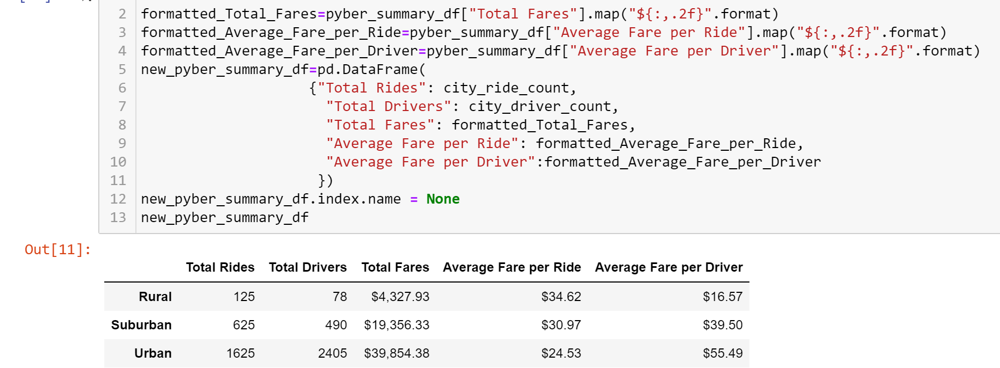
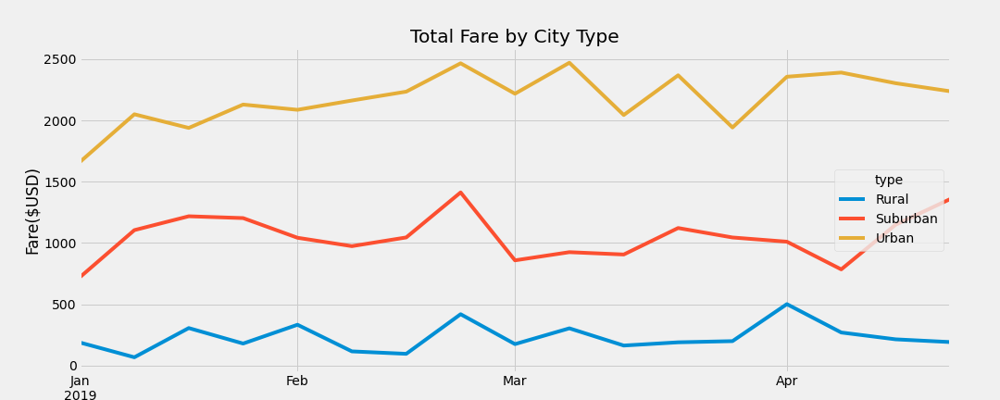

# PyBer_Analysis

## Overview

We created a line graph to tell a story about the data by writing python script using jupyter notebook, pandas library and matplotlib to create a variety of charts to show the relatioshipa between the data.

## Purpose

The aim of the analysis and visualization is to help PyBer improve access to ride sharing services and determine affordability for underserved neighbourhood

### Results

Urban cities have a most number of rides, when compared with the other city types, with a total of 1625 rides with a total fare of $39,854.38 which is almost 7 times more than the tota fares generated in the Rural cities.The other side to this is that Rural cities have the most expensive fare per ride with $34.62. One would expect the Rural drivers to have the most amount of fare considering the high rate of the fare per ride but the average fare per driver is lowest in Rural cities ($16.57) and highest in urban cities ($55.49)

### Summary

Based on the results, I see a need to address the disparities among city types. I will recommend the following:
 1. The company can set a minimum rate for the fares per ride, this will close up the gap in the different fare per ride rate
 2. Give a discounted rate for users who share rides, this will reduce the cost on the passengers and allow the drivers get more rides
 3. Looking at the total fare by city type chart, it appears there is a similar trend in the ride fare per month, encouraging urban drivers to accept rural rides can also help address the disparities